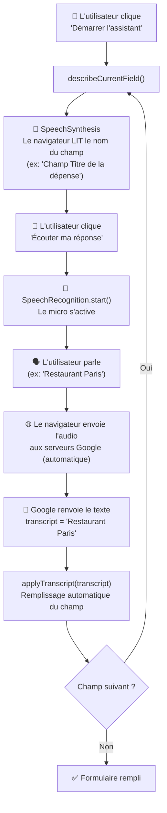
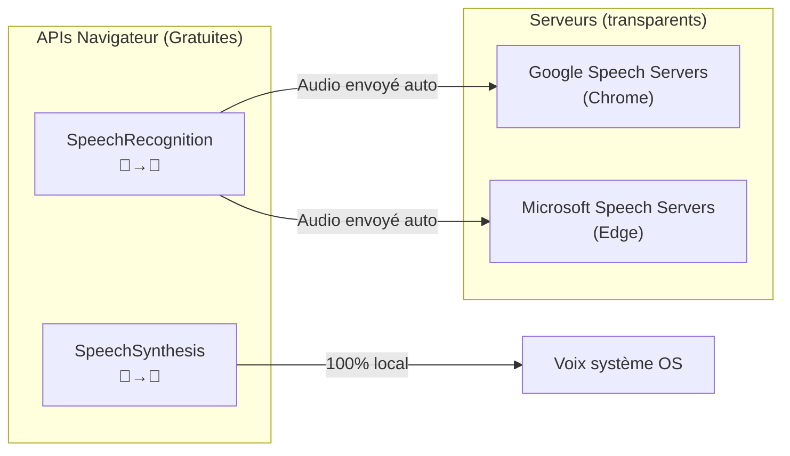

# 🎤 Comment fonctionne l'Assistant Vocal — After Travel

## Résumé Rapide

L'assistant vocal utilise **2 APIs natives du navigateur** (gratuites, sans clé API, sans serveur externe) :

| API | Rôle | Direction |
|-----|-------|-----------|
| **Web Speech API — `SpeechRecognition`** | Écoute la voix → convertit en texte | 🎤 Voix → Texte |
| **Web Speech API — `SpeechSynthesis`** | Lit du texte à haute voix | 📢 Texte → Voix |

> [!IMPORTANT]
> **Aucune API externe payante n'est utilisée pour la voix.** Tout est géré par le navigateur lui-même (Chrome, Edge). Google traite la reconnaissance vocale côté serveur de façon transparente via le navigateur.

---

## Architecture Détaillée



---

## Les 2 APIs en détail

### 1. `SpeechRecognition` — Voix vers Texte 🎤→📝

```javascript
// Détection de l'API (ligne 439 de _form.html.twig)
const SpeechAPI = window.SpeechRecognition || window.webkitSpeechRecognition || null;

// Création de l'instance
rec = new SpeechAPI();
rec.lang = 'fr-FR';           // Langue française
rec.interimResults = false;    // Pas de résultats partiels
rec.maxAlternatives = 3;       // 3 alternatives de transcription
rec.continuous = false;         // S'arrête après une phrase
```

**Comment ça marche en coulisse :**
1. `rec.start()` → active le microphone du navigateur
2. Le navigateur capture l'audio
3. L'audio est envoyé **automatiquement** aux serveurs de Google (pour Chrome) ou Microsoft (pour Edge)
4. Le serveur renvoie le texte reconnu
5. L'événement `result` se déclenche avec le `transcript`

> [!NOTE]
> C'est **gratuit et illimité** — c'est une fonctionnalité intégrée au navigateur. Pas besoin de clé API.

**Compatibilité :**
- ✅ Chrome 25+ (utilise les serveurs Google)
- ✅ Edge 79+ (utilise les serveurs Microsoft)
- ❌ Firefox (non supporté)
- ❌ Safari (support partiel/instable)
- ⚠️ Nécessite **HTTPS** ou **localhost**

---

### 2. `SpeechSynthesis` — Texte vers Voix 📝→📢

```javascript
// Utilisation (ligne 474 de _form.html.twig)
function speak(text, onEnd) {
    if (!window.speechSynthesis || !text) { if (onEnd) onEnd(); return; }
    window.speechSynthesis.cancel();
    const u = new SpeechSynthesisUtterance(text);
    u.lang = 'fr-FR';    // Voix française
    u.rate = 0.9;         // Vitesse légèrement ralentie
    u.volume = 1;         // Volume max
    window.speechSynthesis.speak(u);
}
```

**Comment ça marche :** Entièrement local, le navigateur utilise les voix installées sur le système (pas d'envoi réseau).

---

## Flux utilisateur étape par étape

### Étape 1 : Démarrer l'assistant
```
Bouton "🎯 Démarrer l'assistant" → voiceStartBtn.click()
→ voiceFieldIndex = 0 (premier champ = Titre)
→ describeCurrentField() → speak("Champ Titre de la dépense. Ce champ est vide.")
```

### Étape 2 : Écouter la réponse
```
Bouton "🎤 Écouter ma réponse" → voiceListenBtn.click()
→ rec.start() → micro activé
→ L'utilisateur parle : "Taxi aéroport"
→ Événement 'result' → transcript = "Taxi aéroport"
→ applyTranscript("Taxi aéroport")
```

### Étape 3 : Application intelligente selon le type de champ

| Type de champ | Logique d'application |
|---------------|----------------------|
| **text** (Titre, Lieu) | Texte brut copié directement |
| **number** (Montant) | Extraction du nombre via regex : `n.match(/\d+(?:\.\d+)?/)` |
| **date** | Parsing intelligent : "aujourd'hui", "hier", "12 avril 2024", "12/04/2024" |
| **select** (Catégorie) | Correspondance floue : compare mot par mot avec les options disponibles |

### Étape 4 : Champ suivant
```
Bouton "Champ suivant →" → voiceFieldIndex++
→ describeCurrentField() du champ suivant
→ Cycle : Titre → Montant → Date → Catégorie → Lieu
```

---

## Les 5 champs vocaux

```javascript
const FIELDS = [
    { id: 'depense_titre',       label: 'Titre de la dépense', type: 'text'   },
    { id: 'depense_montant',     label: 'Montant',             type: 'number' },
    { id: 'depense_dateDepense', label: 'Date',                type: 'date'   },
    { id: 'depense_categorie',   label: 'Catégorie',           type: 'select' },
    { id: 'depense_lieu',        label: 'Lieu',                type: 'text'   },
];
```

---

## Gestion des erreurs

Le code gère 6 types d'erreurs micro :

| Erreur | Message affiché |
|--------|----------------|
| `not-allowed` | Microphone refusé → autoriser dans la barre d'adresse |
| `no-speech` | Aucune parole détectée → parler plus fort |
| `network` | Erreur réseau → connexion internet nécessaire |
| `audio-capture` | Aucun microphone détecté |
| `service-not-allowed` | Site pas en HTTPS |
| `aborted` | Écoute annulée par l'utilisateur |

---

## Résumé des technologies



> [!TIP]
> **En résumé : Zéro coût, zéro configuration serveur.** L'assistant vocal repose entièrement sur les APIs Web Speech intégrées au navigateur. La seule "API externe" implicite est celle de Google/Microsoft qui traite l'audio en arrière-plan quand le navigateur utilise `SpeechRecognition`.
